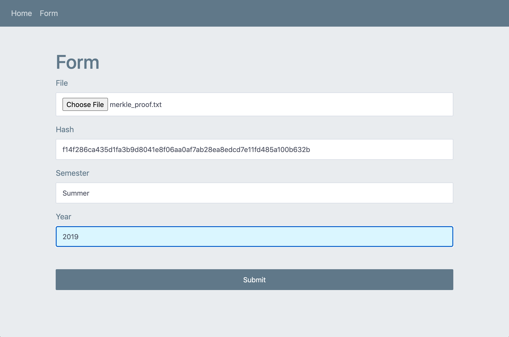

# John Jay Dapps

John Jay Dapp 1 is a Tkinter application. It allows an educational institution to select the semester and year of the graduating class and the directory containing the transcripts of the graduating class. From providing this information, a Merkle Tree can be constructed and a Merkle Root will appear in the associated field.

John Jay Dapp 2 is a Tkinter application. It allows John Jay students to select the semester and year they graduated in and enter their transcript hash. If their hash transcript is in the Merkle Tree, they can send their prospective employer their Merkle proof, which they can in turn use in John Jay Dapp 3.

John Jay Dapp 3 is a Flask application. It allows employers to verify that the John Jay alumni applying for the job at the company has completed their degree at John Jay College at the semester and year specified on their resume. It compares the student’s Merkle proof to the Merkle root retrieved through the contract and verifies that the proof is in fact a proof.

These instructions will get you a copy of the project up and running on your local machine for development and testing purposes. See deployment for notes on how to deploy the project on a live system.

### Prerequisites

- You have installed the latest version of Python(https://www.python.org).
- You have a Windows/Linux/Mac machine.

### Installing and using

To get acclimated, follow the steps below:

1. Fork and clone this repository.
2. In John_Jay_Daap_1 and John_Jay_Daap_2, create a file called .env and provide environment variable information for CONTRACT_ADDRESS, WALLET_PRIVATE_KEY, WALLET_ADDRESS, WEB3_PROVIDER, DATABASE, USER, PASSWORD, HOST, and PORT. The CONTRACT_ADDRESS can be obtained from deploying the smart contract on [Remix Ethereum](https://remix.ethereum.org/). The WALLET_PRIVATE_KEY and WALLET_ADDRESS can be obtained by creating an account on [MetaMask](https://metamask.io). The WEB3_PROVIDER can be obtained by creating an account on [Infura](https://infura.io).
3. In John_Jay_Daap_3, create a file called .env and provide environment variable information for CONTRACT_ADDRESS, WALLET_PRIVATE_KEY, WALLET_ADDRESS, WEB3_PROVIDER, SECRET_KEY, and FLASK_ENV.
4. Create a database in PostgreSQL called jjay.

## Built With

* [Flask](https://flask.palletsprojects.com/en/1.1.x/) - The micro web framework used.
* [Web3.py](https://web3py.readthedocs.io/en/stable/) - The Python library used for interacting with Ethereum.
* [Tkinter](https://docs.python.org/3/library/tkinter.html) - The Python GUI package used.
* [psycopg2](https://pypi.org/project/psycopg2/) - The PostgreSQL database adapter used.

## Versioning

We use [SemVer](http://semver.org/) for versioning. For the versions available, see the [tags on this repository](https://github.com/ahtae/John-Jay-Dapps/tags).

## Authors

* **Kristy Li** - *Initial work* - [ahtae](https://github.com/ahtae)

See also the list of [contributors](https://github.com/ahtae/John-Jay-Dapps/graphs/contributors) who participated in this project.

## License

This project is licensed under the MIT License - see the [LICENSE.md](https://github.com/ahtae/John-Jay-Dapps/blob/master/LICENSE) file for details
